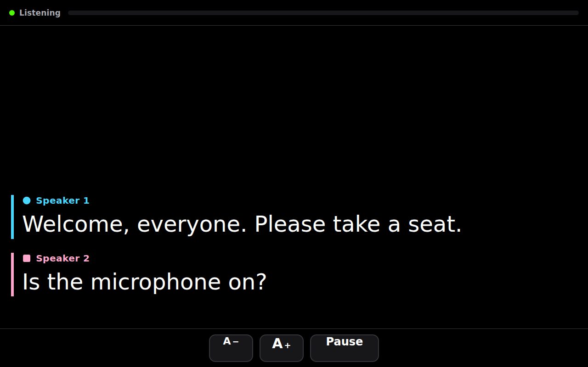

# Captions

A live speech-to-text screen for someone who can't follow conversation in a noisy
room. Turn the tablet on, it starts listening, words appear. Different speakers get
different colours and shapes. Nothing is saved.



---

## Should you build this, or just install an app?

Short answer: **try Google Live Transcribe first — it's free and it might be
enough.** Build this one if you want the "prop it on the table and never touch it"
kiosk behaviour, or if telling speakers apart matters more than it does in the
free apps.

Here's the honest comparison of what's out there:

| Option | Speaker colours | "Just turn it on" | Cost | Catch |
|---|---|---|---|---|
| **[Google Live Transcribe](https://play.google.com/store/apps/details?id=com.google.audio.hearing.visualization.accessibility.scribe)** (Android) | Yes, colour-coded words | No — unlock, open app, it starts | Free, unlimited | Android only. Built by Google's accessibility team and genuinely the most robust in noise. **Start here.** |
| **[Ava](https://www.ava.me/)** (iOS/Android/web) | Yes — this is its signature feature | No — unlock, open, sign in | Free tier caps sessions at ~40 min; ~$10–15/mo for more | Purpose-built for Deaf/HoH users. The 40-minute cap bites during a church service. Requires an account. |
| **Apple Live Captions** (iPad, built in) | No — one undifferentiated stream | No, but close: it's a Control Centre toggle | Free | On-device, no account, no internet needed. Small floating window, not a full screen of readable text. |
| **Otter / Notta** | Yes | No | Subscription | Built for meeting notes. They record and store everything, which you said you didn't want, and the UI is dense. |
| **This repo** | Yes — 6 colours + 6 shapes | **Yes** — boots into it, auto-starts | ~$0.41/hour of listening | You have to host a small server and hold an API key. |

**My recommendation:** put Live Transcribe on an Android tablet this week and take
it to one lunch. That tells you whether the transcription quality is good enough in
the rooms she's actually in — which is the real question, and it's free to answer.
If quality is fine but the ritual of unlocking and finding the app trips her up,
deploy this repo, which fixes exactly that. If quality is *not* fine, no app will
save you and you should read the next section carefully.

## The part that matters more than the software

**In a reverberant room, the microphone is the bottleneck, not the speech
recognition.** A tablet mic thirty feet from a pulpit picks up mostly room echo and
HVAC, and every app on that list will produce mush from it. This is the single
biggest factor in whether this works.

In rough order of how much difference they make:

1. **Ask the church for their assistive listening receiver.** Most assembly
   spaces have one, and the ADA requires those systems to expose a standard
   headphone jack. That jack carries the pulpit microphone directly — no room, no
   echo, no distance. Run it into the tablet through a cheap TRRS adapter and the
   transcript quality goes from "unusable" to "near perfect." This is the single
   highest-leverage thing on this page, and it's free. Ask the sound desk.
2. **For lunch and small groups, put a mic on the table.** Any small USB or
   lightning conference mic at 1–3 feet beats a tablet at 6 feet by a wide margin.
3. **Point the tablet at the talker, not at the room**, and get it as close as is
   polite.

For the community meetings, it's worth asking whether they have a PA system with a
line out. Same trick as the church.

---

## Running it

```bash
python3 -m venv .venv
.venv/bin/pip install -r requirements.txt
cp .env.example .env          # add your Deepgram key
.venv/bin/python -m uvicorn server.app:app --host 0.0.0.0 --port 8000
```

Open `http://localhost:8000`. It starts listening as soon as the page loads.

**Without a `DEEPGRAM_API_KEY`** it still works — it falls back to the speech
recognition built into Chrome, which is free and needs no setup, but cannot tell
speakers apart, so every caption comes out in plain white. That's a fine way to
try the thing out before signing up for anything.

**With a key**, audio is relayed to [Deepgram](https://deepgram.com) with speaker
diarization on. That costs about **$0.0068/minute — roughly $0.41 per hour** of
listening. A weekly church service plus a couple of lunches lands somewhere around
$2–3 a month.

### Hosting it

The tablet needs to reach the server over the internet (she's at church; the server
isn't). Any small host works — Fly.io, Render, Railway. Two requirements:

- **HTTPS.** Browsers refuse microphone access otherwise.
- **WebSocket support.** That's the transport for audio.

Set `DEEPGRAM_API_KEY` in the host's environment. The key stays server-side; the
browser never sees it.

## Making it "just turn it on"

This is the part the off-the-shelf apps can't do. On an Android tablet:

1. Install **[Fully Kiosk Browser](https://www.fully-kiosk.com/)** (free; the ~$12
   Plus licence is not required for this).
2. Set **Start URL** to your deployed address.
3. Turn on **Start on Boot**, **Keep Screen On**, and under Web Content Settings,
   **Enable Microphone Access**.
4. In Android settings, set screen lock to **None**.

Now the tablet boots straight into captions with no lock screen, no app drawer, and
no prompts. Power button on, words appear. If she hits the power button by accident,
pressing it again brings it right back.

Add a **cheap kickstand case** so it props up on a table at reading angle.

An iPad can't auto-launch an app on boot, so the best you get there is Guided
Access, which still needs someone to open Safari first. If the goal is a device
grandma never has to navigate, use an Android tablet.

## What it deliberately doesn't do

- **Doesn't save anything.** No recording, no transcript file, no database. Audio
  is forwarded and dropped; captions live in the browser tab until it closes.
  Old lines scroll off and are discarded.
- **Doesn't name people.** It can tell that voices are *different* — that's
  diarization, and it's the honest limit of the technology. It can't know that
  Speaker 2 is Margaret. Colours and shapes let her follow a back-and-forth
  without needing names.
- **Doesn't have settings.** Text size, pause, and nothing else. Every additional
  button is one more thing to get lost in.

## Design notes

- **Captions are always white**, whatever the speaker colour. Identity lives in
  the marker above each block, so legibility is never traded for colour-coding.
- **Speaker colours never carry meaning alone.** Each of the six slots pairs a
  colour with a distinct shape (circle, square, triangle, diamond, hexagon, star)
  and a spelled-out "Speaker N". The palette was validated as a set against a
  black surface with all fifteen pairs in play: worst colour-blind separation
  ΔE 8.8, worst normal-vision ΔE 19.8, every slot at 7:1 contrast or better. A
  seventh voice falls back to plain white rather than inventing a hue nobody
  could distinguish.
- **No speaker labels until a second voice appears.** A solo sermon is just
  words on a screen; the colour chrome appears the moment it becomes useful, and
  applies retroactively to what's already up.
- **New text at the bottom**, like TV captions, so her eyes rest in one place.
- **A live level meter** in the status bar answers "is this thing even hearing
  anything?" without reading a word.

## Layout

```
server/app.py      FastAPI: serves the page, relays audio to Deepgram
web/index.html     the caption screen
web/app.js         capture, transcript rendering, speaker assignment
web/styles.css     the palette and the kiosk layout
web/pcm-worklet.js resamples mic audio to 16 kHz PCM off the main thread
```
